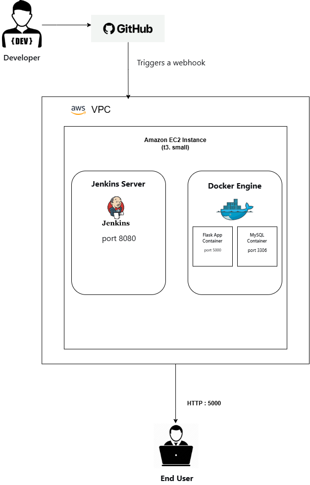

# Two-Tier Flask App CI/CD Pipeline on AWS EC2

## Architecture

## Project Overview
This project demonstrates a fully automated CI/CD pipeline for a containerized two‑tier web application (Flask + MySQL) deployed on a single **AWS EC2 instance**. The pipeline is managed by **Jenkins**, and **Docker** with **Docker Compose** is used to orchestrate the application containers. Every `git push` to the main branch triggers an automated build and deployment, ensuring repeatable, hands‑free updates.

This fork extends the original tutorial with in‑depth troubleshooting, infrastructure improvements, and professional documentation – reflecting real‑world DevOps and Cloud Support skills.

## Tech Stack
- **Cloud:** AWS EC2 (Ubuntu 22.04, t3.small)
- **CI/CD:** Jenkins (Pipeline‑as‑Code)
- **Containerization:** Docker, Docker Compose
- **Application:** Flask (Python), MySQL
- **Version Control:** GitHub

## Architecture
1. Developer pushes code to the GitHub repository.
2. GitHub triggers a webhook (or manual trigger) to Jenkins running on the EC2 instance.
3. Jenkins pipeline executes three stages:
   - **Clone Code** – pulls the latest code from the repository.
   - **Build Docker Image** – builds the Flask application image using the `Dockerfile`.
   - **Deploy with Docker Compose** – stops any existing containers and starts fresh `flask` and `mysql` containers.
4. The Flask application becomes available at `http://<ec2-public-ip>:5000`.

## Deployment Steps (Summary)
1. Launch an EC2 instance (Ubuntu 22.04, t3.small) and configure security groups to allow ports **22**, **5000**, and **8080**.
2. SSH into the instance and install **Docker**, **Docker Compose**, and **Git**.
3. Install **Jenkins** with **Java 21** (required by the latest Jenkins releases).
4. Fork this repository and update the `Jenkinsfile` with your own repository URL.
5. Create a Jenkins Pipeline job pointing to your fork and run the build.

## 🚧 Challenges & Troubleshooting (Real Issues Resolved)
Throughout this deployment, several real‑world issues were encountered and systematically resolved. Each one built critical cloud and DevOps debugging skills.

### 1. Jenkins failed to start – Java version mismatch
**Error:**  
`Running with Java 17 … older than the minimum required version (Java 21).`  
**Root cause:** Jenkins now requires Java 21 or higher, but only `openjdk-17-jdk` was installed.  
**Fix:**  
- Installed `openjdk-21-jdk` and set it as the system default.
- Updated `JAVA_HOME` in `/etc/default/jenkins` and restarted Jenkins.

### 2. Disk space critically low on the EC2 instance
**Symptom:** Jenkins alerted “Free Disk Space below threshold”, root filesystem hit 97% usage (`/dev/root 6.7G`).  
**Root cause:** The default 8 GiB EBS volume was too small for Jenkins, Docker images, and build artifacts.  
**Fix:**  
- Immediate cleanup: removed unused Docker objects, Jenkins workspaces, and system logs.
- Permanent fix: **expanded the EBS volume** from 8 GiB to 20 GiB via the AWS console, then grew the Linux partition and filesystem online (no downtime) using `growpart` and `resize2fs`.

### 3. Jenkins built‑in node offline / “Waiting for next available executor”
**Symptom:** Pipeline stuck at “Waiting for next available executor”, built‑in node showed `offline`.  
**Root cause:**  
- The built‑in node had **0 executors** by default.
- The `Free Temp Space` threshold was set to 1 GiB, but `/tmp` was a tmpfs of ~953 MiB.  
**Fix:**  
- Set **Number of executors** to `1` in the node configuration.
- Lowered the disk and temp space thresholds to `500 MiB`.
- Brought the node back online.

### 4. Jenkins pipeline “Build image” failed – Docker permission denied
**Error:** `docker build -t flask-app .` failed with a permission error.  
**Root cause:** The `jenkins` user was not in the `docker` group.  
**Fix:** Added `jenkins` to the `docker` group and restarted Jenkins.

### 5. Flask container “unhealthy” – healthcheck timing
**Observation:** `docker ps` showed the Flask container as `(unhealthy)`, even though the app was reachable.  
**Cause:**  
- The healthcheck expected a `/health` endpoint that may not exist in the base app.
- MySQL sometimes took longer to be ready than the `depends_on` wait.  
**Temporary workaround:** Restarting the Flask container after MySQL was fully initialized resolved the issue.  
**Long‑term fix (planned):** Add a proper `/health` route and refine the Docker Compose healthcheck.

### 6. Docker Compose `version` key obsolete warning
**Warning:** `the attribute 'version' is obsolete, it will be ignored`  
**Fix:** Removed the `version: "3.8"` line from `docker-compose.yml` (modern Docker Compose v2 detects the format automatically).

## Future Improvements
- **Infrastructure as Code:** Provision the EC2 instance and security groups with **Terraform**.
- **Monitoring:** Integrate **Prometheus & Grafana** for container and Jenkins metrics.
- **Notifications:** Send Slack/email alerts on build failures.
- **Deployment strategy:** Implement Blue‑Green or Canary deployments.
- **Code quality:** Add **SonarQube** or linting stages to the pipeline.
- **Persistent database:** Use a managed database (AWS RDS) for production‑grade reliability.

## Key Takeaways
- Real‑world CI/CD requires not just automation, but the ability to **diagnose and resolve** environmental constraints (disk space, Java versions, permissions).
- Linux disk management (`growpart`, `resize2fs`) is essential for cloud operations.
- Jenkins configuration details (executors, node monitors, thresholds) can block pipelines if not properly tuned.
- Documentation of every error and fix turns a tutorial project into a compelling portfolio piece.

## Credits
Original project by [Prashant Gohel](https://github.com/prashantgohel321/DevOps-Project-Two-Tier-Flask-App).  
This fork extends the deployment with personal troubleshooting, infrastructure improvements, and detailed documentation.

## Author
**Saliu Aminu Oshioke**  
[GitHub](https://github.com/oshiokefred-collab)  
